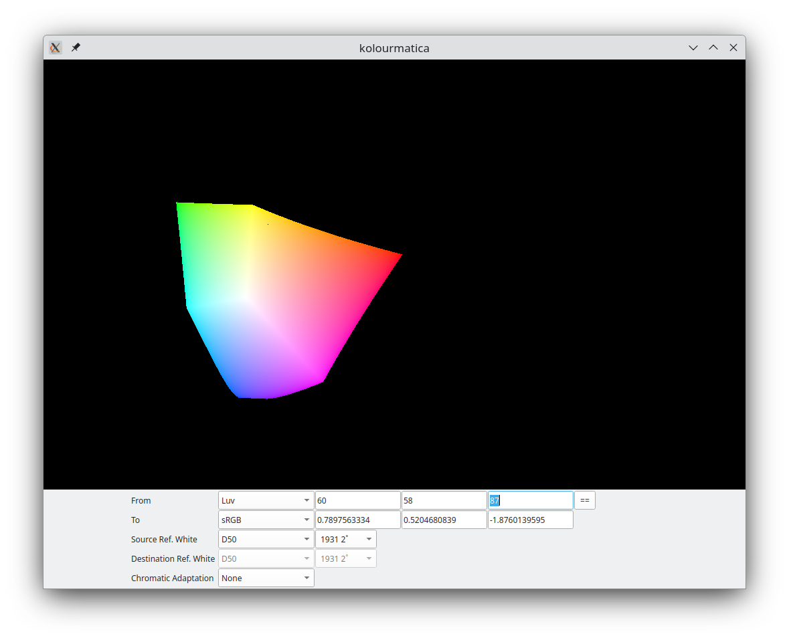

Kolourmatica
============

A simple colour space calculator for GNU/Linux.

Requirements
------------

* [Qt 6.x](https://doc.qt.io/)
* [Eigen 3](http://eigen.tuxfamily.org/index.php?title=Main_Page)
* [Boost.Preprocessor](https://www.boost.org/doc/libs/1_85_0/libs/preprocessor/doc/index.html)

Build
-------

    $ git clone https://github.com/Arlen/Kolourmatica.git
    $ cd Kolourmatica
    $ cmake .
    $ make

TODO
----
Please see [TODO][todo]

[todo]: https://github.com/Arlen/Kolourmatica/blob/master/TODO
